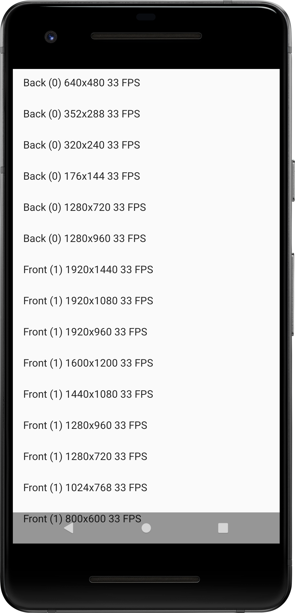

EchoShot - AI-Powered Video Analysis App
========================================

EchoShot is an Android application that combines video recording with advanced AI-powered analysis capabilities including object detection, pose estimation, and single object tracking (SOT) using SiamRPN++ Mobile model.

Features
--------

### Video Recording
- High-quality video recording using Camera2 API
- Configurable resolution, frame rate, and camera selection
- HDR and SDR format support
- Preview stabilization

### AI-Powered Analysis
- **Object Detection**: YOLOv8-based real-time object detection
- **Pose Estimation**: MoveNet-based human pose estimation
- **Single Object Tracking (SOT)**: SiamRPN++ Mobile-based tracking
  - MobileNetV2 backbone with width_mult: 1.4
  - Used layers: [3, 5, 7]
  - Exemplar size: 127x127, Instance size: 255x255
  - Anchor configuration: 5 anchors with ratios [0.33, 0.5, 1, 2, 3] and scales [8]

### SOT Configuration
The SiamRPN++ Mobile model is configured with the following parameters:
- **META_ARC**: "siamrpn_mobilev2_l234_dwxcorr"
- **BACKBONE**: MobileNetV2 (width_mult: 1.4, used_layers: [3, 5, 7])
- **ADJUST**: AdjustAllLayer (in_channels: [44, 134, 448], out_channels: [256, 256, 256])
- **RPN**: MultiRPN (anchor_num: 5, in_channels: [256, 256, 256])
- **ANCHOR**: stride=8, ratios=[0.33, 0.5, 1, 2, 3], scales=[8]
- **TRACK**: penalty_k=0.04, window_influence=0.4, lr=0.5, context_amount=0.5

[1]: https://developer.android.com/reference/android/hardware/camera2/package-summary.html
[2]: https://developer.android.com/reference/android/media/MediaRecorder

Pre-requisites
--------------

- Android SDK 33+
- Android Studio 3.6+
- Device with video capture capability (or emulator)
- ONNX Runtime Mobile for SiamRPN++ model inference
- OpenCV for Android for image processing

Screenshots
-------------

Getting Started
---------------

This project uses the Gradle build system. To build this project, use the
"gradlew build" command or use "Import Project" in Android Studio.

### SOT Usage
1. Record or select a video file
2. Use the SOT picker to select the initial bounding box for tracking
3. The app will generate a JSONL file with tracking results
4. Each frame contains detection information with confidence scores and bounding box coordinates

Support
-------

- Stack Overflow: http://stackoverflow.com/questions/tagged/android

If you've found an error in this sample, please file an issue:
https://github.com/android/camera-samples

Patches are encouraged, and may be submitted by forking this project and
submitting a pull request through GitHub. Please see CONTRIBUTING.md for more details.
